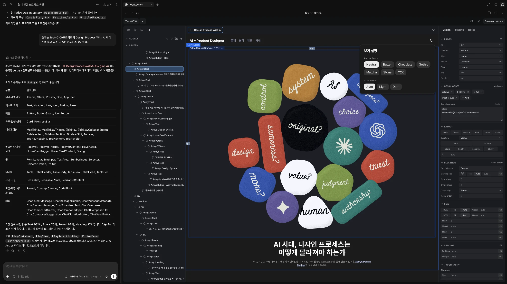

# Workbench

[English](README.en.md) · 한국어

디자이너가 **실제 코드 위에서** 디자인하는 로컬 저작 도구입니다.

> 개인·회사 내부 업무 사용과 결과물 판매는 허용합니다. Workbench 자체의 유료
> 재판매 및 이를 이용한 경쟁 제품·서비스 제공은 제한합니다. [라이선스](#라이선스)

화면에서 고친 내용이 그대로 프로젝트의 `.tsx` 파일로 저장됩니다. 따로 관리할 디자인
파일도, 개발자에게 넘길 시안도 없습니다.



Codex에 프로젝트 폴더를 연결해 작업하는 모습입니다. 왼쪽에서는 Codex가 이 페이지에 쓰인
컴포넌트를 정리하고, 오른쪽 Workbench에는 같은 페이지가 레이어와 인스펙터로 열려 있습니다.

## 이걸로 할 수 있는 일

- AI 코딩 에이전트가 만든 화면을 **레이어와 인스펙터로 열어서 직접 수정**
- 화면을 보면서 **디자인 토큰**을 고치고, 그 토큰을 쓰는 모든 컴포넌트에 즉시 반영
- 피그마의 컴포넌트와 변수를 **프로젝트의 실제 컴포넌트와 토큰으로** 옮기기
- 수정 결과를 **커밋 가능한 소스 코드**로 남기기 — 핸드오프 단계 없음

### 알아두면 좋은 것

코드를 직접 쓸 줄 몰라도 됩니다. 다만 **CSS와 Tailwind 클래스에 대한 감각이 있으면
훨씬 수월합니다.** 인스펙터가 보여주는 값이 실제 클래스와 스타일 속성이기 때문입니다.
"`p-4`가 패딩이구나" 정도를 알면 충분합니다.

React 프로젝트를 다룹니다.

---

# 시작하기

터미널을 쓰는 단계가 있습니다. 익숙하지 않다면 팀의 개발자에게 이 섹션을 보여주세요.
한 번만 하면 됩니다.

## 1. 설치

Node.js와 git이 필요합니다.

```sh
git clone https://github.com/momtoom/workbench.git ~/workbench
cd ~/workbench
npm install
```

pnpm도 됩니다. 아래 명령은 전부 `pnpm run`으로 바꿔 쓸 수 있습니다.

## 2. AI 코딩 에이전트 연결

Workbench에는 AI가 내장돼 있지 않습니다. **이미 쓰고 있는 Claude Code나 Codex를
연결합니다.** 별도 요금이 붙지 않고, 나중에 다른 도구로 바꿔도 됩니다.

```sh
# Claude Code
claude mcp add --scope user workbench -- node ~/workbench/scripts/workbench-authoring-mcp.mjs

# Codex
codex mcp add workbench -- node ~/workbench/scripts/workbench-authoring-mcp.mjs
```

한 번 등록하면 끝입니다.

## 3. 열기

```sh
npm run dev
```

브라우저에서 터미널에 표시된 주소(보통 `http://127.0.0.1:5174`)로 접속합니다.

## 4. 프로젝트 만들기

첫 화면에서 **Initialize project**를 누르고, 프로젝트 이름과 셋업을 정한 뒤
**Initialize**를 누릅니다. 저장할 위치를 고르면 그 안에 프로젝트 폴더가 생기고,
필요한 패키지도 알아서 설치됩니다.

| 셋업 | 내용 |
| --- | --- |
| Default | 빈 상태에서 시작 |
| shadcn | shadcn 스타일 컴포넌트 세트 |
| Astryx | Astryx 디자인 시스템과 테마 (Meta 오픈소스) |

그 폴더에 `.workbench/` 설정과 시작 페이지, 그리고 **에이전트용 지침 파일**이
만들어집니다. 마지막이 중요합니다 — 이 폴더에서 AI를 실행하면 Workbench 프로젝트라는
걸 알아서 인식합니다.

만들어 둔 프로젝트는 **Open project**로 엽니다.

## 5. 첫 페이지 만들기

**프로젝트 폴더에서** AI를 실행합니다. 이게 중요합니다.

```sh
cd ~/my-project   # 4번에서 만든 프로젝트 폴더
claude
```

Workbench는 어느 프로젝트에 쓸지 짐작하지 않습니다. 엉뚱한 프로젝트의 파일을 건드리는
사고를 막기 위해서라, 작업할 폴더에서 실행해야 합니다.

그리고 평소처럼 말하면 됩니다.

> "설정 페이지 만들어줘. 계정 섹션이랑 알림 토글 넣고."

AI는 새로 만들기 전에 **프로젝트에 이미 있는 컴포넌트를 먼저 찾습니다.** 그래서 화면이
쌓일수록 같은 언어로 조립됩니다. 만든 결과가 실제로 렌더되는지 확인하는 단계도
거칩니다.

브라우저를 보면 페이지가 떠 있습니다. 이제 직접 고칠 차례입니다.

---

# 화면 구성

왼쪽 세로줄에 큰 메뉴 4개가 있습니다.

| 아이콘 | 메뉴 | 하는 일 |
| --- | --- | --- |
| <picture><source media="(prefers-color-scheme: dark)" srcset="docs/assets/icons/images-dark.svg"></picture> | **Asset Manager** | 아이콘·이미지·폰트를 설치하고 프로젝트에 등록 |
| <picture><source media="(prefers-color-scheme: dark)" srcset="docs/assets/icons/palette-dark.svg"></picture> | **Token Editor** | 색·타이포·간격·모서리 토큰을 만들고 수정 |
| <picture><source media="(prefers-color-scheme: dark)" srcset="docs/assets/icons/book-open-dark.svg"></picture> | **Storybook** | 컴포넌트를 변형별로 확인 |
| <picture><source media="(prefers-color-scheme: dark)" srcset="docs/assets/icons/braces-dark.svg"></picture> | **Design Editor** | 페이지를 캔버스에서 편집 — 주 작업 공간 |

Design Editor 안은 세 영역입니다. **가운데 캔버스**, **왼쪽 Layers**, **오른쪽
Inspector**. 캔버스에서 무언가를 고르면 Layers에서 같은 항목이 짚이고, Inspector에
그 요소의 값이 나옵니다.

Inspector에 보이는 값은 설명이 아니라 **실제 코드에 적힌 값 그대로**입니다.

---

# 편집하기

## 고르기

**클릭**하면 선택됩니다. 다만 컴포넌트는 하나의 덩어리로 잡힙니다. 카드를 클릭하면
카드가 선택되지, 카드 안의 제목이 선택되지는 않습니다.

**더블클릭**하면 안으로 들어갑니다(드릴인). 카드를 더블클릭하면 그 안의 제목과 본문을
개별로 고를 수 있게 됩니다. 피그마에서 그룹 안으로 들어가는 것과 같습니다.

**Shift + 클릭**으로 여러 개를 함께 고릅니다.

## 단축키

디자인 도구에서 쓰던 것과 거의 같습니다. (`Cmd`는 Windows에서 `Ctrl`)

| 단축키 | 하는 일 |
| --- | --- |
| `Cmd + Z` | 실행 취소 |
| `Cmd + Shift + Z` · `Cmd + Y` | 다시 실행 |
| `Cmd + C` · `Cmd + X` | 복사 · 잘라내기 |
| `Cmd + V` | **아래에** 붙여넣기 (형제로) |
| `Cmd + Shift + V` | **안에** 붙여넣기 (자식으로) |
| `Cmd + D` | 복제 |
| `Backspace` · `Delete` | 삭제 |
| `I` | 선택한 것 안에 요소 추가 |
| `Shift + W` · `Cmd + Shift + G` | 감싸기 |
| `↑` `↓` | 순서 위아래로 |
| `Alt + ←` · `Alt + →` | 한 단계 바깥으로 · 안으로 |
| `Alt + W` | 현재 탭 닫기 |

붙여넣기가 둘인 이유는 코드에 계층이 있기 때문입니다. `Cmd + V`는 선택한 것 **옆에**,
`Cmd + Shift + V`는 **안에** 들어갑니다.

## 감싸기 (Wrapping)

`Shift + W`를 누르면 선택한 요소들을 무언가로 감쌀 수 있습니다. 두 종류입니다.

- **컴포넌트로 감싸기** — 프로젝트의 레이아웃 컴포넌트나 상위 컴포넌트로. 예를 들어
  버튼 세 개를 골라 `Stack`으로 감싸면 정렬 규칙이 적용됩니다
- **HTML 태그로 감싸기** — `section`, `div` 같은 태그로. 의미 구조가 필요할 때

아무거나 감쌀 수 있는 건 아닙니다. 컴포넌트가 받을 수 있는 자식이 정해져 있으면
Workbench가 막고 이유를 알려줍니다.

## 토큰 고치기

Token Editor에서 색이나 간격을 바꾸면 그 토큰을 쓰는 **모든 컴포넌트에 즉시
반영**됩니다. 결과는 프로젝트의 `src/workbench-tokens.css`에 저장됩니다.

토큰은 3단계로 묶여 있습니다.

```
기본값(primitive)    #0f172a, 16px 같은 실제 값
의미(semantic)       surface.default → slate.900
컴포넌트(component)  button.bg      → surface.default
```

브랜드 색 하나를 바꾸면 그걸 참조하는 의미 토큰이 따라 바뀌고, 다시 그걸 쓰는
컴포넌트가 따라 바뀝니다. 라이트/다크 모드도 같은 방식입니다.

## 어떤 부분은 못 고칩니다

화면에는 보이는데 Layers에서 선택이 안 되는 영역이 있습니다. 대개 **서버에서 받아오는
데이터로 그려지는 부분**입니다 — 목록 개수가 실행할 때마다 달라지는 영역 같은 것들이죠.

Workbench는 그런 부분을 **편집 경계**로 표시하고, 억지로 편집되는 척하지 않습니다.
그 영역을 바꾸려면 AI에게 말하거나 개발자와 상의하면 됩니다.

---

# 쓰던 디자인 시스템 가져오기

AI 쪽에 피그마 연결(MCP)이 돼 있으면 옮겨올 수 있습니다. **순서가 중요합니다.**

**1) 토큰 먼저** — 컴포넌트가 참조할 대상이기 때문입니다. 피그마 변수를 JSON으로
내보내서 건네주세요.

> "이 피그마 변수 export를 Workbench 토큰으로 올려줘."

피그마의 컬렉션과 모드가 그대로 대응됩니다. 라이트/다크를 쓰고 있었다면 구조가
유지됩니다.

**2) 아이콘·이미지·폰트** — 이것도 컴포넌트보다 먼저입니다.

> "이 아이콘 세트 설치하고 등록해줘."

**3) 컴포넌트** — 작은 것부터, 그다음 조합.

> "이 피그마 컴포넌트를 Workbench 컴포넌트로 변환해줘. `<피그마 URL>`"

여기서 결과가 실제로 **편집 가능한지**가 갈립니다. 피그마의 variant 축(Size, State,
Selected 같은 것)이 전부 조절 가능한 항목으로 나와야 하고, 리스트 행이나 메뉴 항목처럼
**반복되는 요소는 하나씩 고를 수 있는 형태**여야 합니다. Workbench가 검사해서 안 맞으면
거부합니다.

**4) 페이지** — 올라간 컴포넌트로 조립합니다.

---

# 왜 이렇게 만들었나

AI에게 화면을 만들어 달라고 하면 결과물은 **코드**로 나옵니다. 개발자는 그걸 바로
고칩니다. 디자이너는 못 고칩니다. 그래서 같은 출발점에서도 이렇게 갈립니다.

```
아이디어 → AI 생성 → 완성된 화면
                        │
              코드를 편집할 수 있는가?
                  ├── 예 ──→ 그대로 이어서 수정             … 몇 분
                  └── 아니오 ─→ 디자인 도구에서 다시 만들기
                                → 개발자에게 전달
                                → 다시 구현                 … 며칠
```

이 차이는 실력이 아니라 **도구** 때문입니다.

같은 문제가 팀 전체에서 반복됩니다. 기획자가 프로토타입을 만들어도 디자이너는 그걸
수정하지 못해 다시 만들고, 개발자는 전달받은 시안을 다시 코드로 구현합니다. 모두가
만들 수 있게 됐는데 **서로가 만든 걸 이어받지 못합니다.**

Workbench는 셋이 같은 파일에 쓰게 합니다.

```
   디자인 시스템          코딩 에이전트            디자이너
   기준을 정합니다        화면을 만듭니다          결과를 고칩니다
   토큰 · 컴포넌트   →    TSX 소스           →     시각 편집
         └──────────────────────┴───────────────────────┘
              하나의 프로젝트 · 조직의 저장소
```

그래서 프로젝트가 클라우드 계정이 아니라 **로컬 폴더**입니다. 디자인 시스템과 제품
코드에는 파일과 변경 이력뿐 아니라 조직이 쌓아온 판단이 녹아 있습니다. 도구를 고를 때
물어야 할 것은 그 도구가 무엇을 해주는지가 아니라, **그 도구를 걷어냈을 때 무엇이
남는지**입니다.

배경 논의는 [Design Process With AI](https://momtoom.github.io/workbench/design-process/)에
정리되어 있습니다. 그 문서 자체가 Workbench로 만들고 편집한 페이지입니다.

## Workbench가 아닌 것

| | |
| --- | --- |
| 코드 생성기 | 한 번 뱉고 끝이 아닙니다. 계속 편집하는 대상으로 다룹니다 |
| 디자인 툴 | 별도의 디자인 파일이 없습니다. 원본은 항상 소스 코드입니다 |
| 프로토타입 툴 | 버려지는 목업이 아니라 제품에 남는 코드입니다 |
| AI 채팅 앱 | 앱 안에 프롬프트 입력창이 없습니다. AI는 밖에서 연결합니다 |
| 클라우드 서비스 | 소스는 여러분의 저장소에 남습니다 |

아이디어 스케치나 사용자 리서치용 목업이라면 피그마가 더 편합니다. Workbench는
**이미 코드가 된 화면**을 다루는 도구입니다.

---

# 기술 문서

<details>
<summary>개발자를 위한 내용 — 펼치기</summary>

## 구조

브라우저에서 도는 React 앱이고, 로컬 프로젝트 폴더를 읽고 씁니다.

```
src/              앱 (도메인 / 기능 / 공유 UI)
host/             로컬 호스트 계층
  local-bridge/     배포한 앱과 내 컴퓨터의 프로젝트를 잇는 연결 서버
  local-preview/    프로젝트 TSX를 프리뷰용으로 컴파일
scripts/          MCP 서버, 프로젝트 템플릿, 검사
api/ server/      선택적 호스팅 코어 (없어도 로컬 사용에는 지장 없음)
```

평소처럼 `npm run dev`로 실행하면 개발 서버(`vite.config.ts`)가 프로젝트 파일을 직접
다루므로 연결 서버는 필요 없습니다. 배포한 앱을 쓸 때만 `npm run workbench:bridge`로
켭니다.

AI는 앱 안이 아니라 **MCP 서버를 통해** 붙습니다. 에이전트에게 파일 쓰기 권한을 주는
대신, 검증 단계가 붙은 도구를 줍니다.

| | 하는 일 |
| --- | --- |
| 컨텍스트 조회 | 프로젝트의 페이지·컴포넌트·토큰·자산 목록을 실제로 읽고 시작합니다 |
| 등록과 쓰기 | 토큰·컴포넌트·자산을 소스와 목록에 한 번에 기록합니다 |
| 페이지 검증 | 저장된 페이지가 계속 편집 가능한지 검사하고, 위반이 있으면 작업을 못 끝내게 합니다 |

엉뚱한 프로젝트에 쓰는 것, 의도를 넘겨짚는 것, 확인 없이 끝내는 것을 각각 막습니다.
막히면 이런 코드가 나옵니다 — **프로젝트 이름이나 경로를 말해주면** 풀립니다.

```
WB-AUTH-PROJECT-SESSION-UNBOUND    아직 프로젝트를 지정하지 않음
WB-AUTH-PROJECT-TARGET-NOT-FOUND   그 이름의 프로젝트를 못 찾음
WB-AUTH-PROJECT-TARGET-AMBIGUOUS   후보가 둘 이상 — 경로로 특정하라
```

## 편집 깊이는 코드 모양이 정합니다

평범한 React를 쓰면 됩니다. 로컬 헬퍼, 배열, `.map(...)`, 조건부, 콜백 전부
허용됩니다. 다만 소스를 **정적으로 읽어낼 수 있는 만큼만** 디자이너가 개별 항목을
만질 수 있습니다. 금지 목록이 아니라 트레이드오프입니다.

배열이 코드에 그대로 적혀 있으면 항목 하나하나가 Layers에 올라옵니다.

```tsx
const FEATURES = [                      // 파일 안에 값이 있음
  { title: '빠른 왕복', body: '…' },
  { title: '토큰 우선', body: '…' },
];

export function Page() {
  return <ul>{FEATURES.map((f) => <li key={f.title}>{f.title}</li>)}</ul>;
}
```

런타임 데이터를 `.map()`하면 그 부분은 편집 경계가 됩니다. 화면에는 정상적으로
그려지고 소스도 보존되지만, Layers에서 항목을 따로 만지지는 못합니다.

| 상황 | 선택 |
| --- | --- |
| 디자이너가 항목을 하나씩 만져야 함 | 값을 코드에 적고 `.map()`, 또는 JSX를 펼치기 |
| 재사용 조각을 Layers에서도 다뤄야 함 | 별도 파일로 빼고 `import` |
| 런타임 데이터로 그리는 영역 | 평범하게 쓰고 편집 경계로 두기 |

프로젝트에 설치되는 `workbench-design-authoring` 스킬이 같은 기준을 담고 있어
에이전트가 이 판단을 같이 합니다.

## 다루는 소스의 성격

최종 프로덕션 빌드 산출물이 아니라 **디자이너가 화면을 이해하고 바꾸기 위한, 동작하는
편집 가능한 디자인 소스**입니다. 진짜 React/TSX이고 빌드되고 돌아갑니다. 프로덕션
최적화된 구조와 편집 모델이 충돌하면 **편집 가능한 쪽을 택하고 나머지는 핸드오프
경계로 남깁니다.**

- 화면 계층은 소스에 명시적으로 남습니다
- 디자이너가 만져야 할 것은 prop, 배열, 토큰으로 노출됩니다
- provider 더미, 데이터 클라이언트, 가상 스크롤, 차트, 리치 에디터는 런타임 섬이나
  핸드오프 영역으로 둡니다
- 모든 DOM 노드를 편집할 수 있는 척하지 않고 읽기 전용 경계를 정직하게 드러냅니다

프레임워크 통합, 데이터 배선, 테스트, 접근성, 성능, 배포 검증은 개발자 몫입니다.

## 검증

```sh
npm run check                     # 타입체크
npm run build                     # 프로덕션 빌드
npm run workbench:check-harness   # 에이전트 하네스 검사
```

## 범위

React 소스 편집을 지원합니다. 프레임워크당 어댑터 하나를 등록하는 구조라 다른
프레임워크를 추가할 수 있습니다.

</details>

## 문서

| 문서 | 내용 |
| --- | --- |
| [PRODUCT-PHILOSOPHY](docs/WORKBENCH-V1-PRODUCT-PHILOSOPHY.md) | 무엇을 만들고 무엇을 안 만드는가 |
| [AGENT-GUIDE](docs/WORKBENCH-V1-AGENT-GUIDE.md) | 에이전트 작업 규칙 (Claude Code / Codex 공용) |
| [STRUCTURED-AUTHORING-GATEWAY](docs/WORKBENCH-V1-STRUCTURED-AUTHORING-GATEWAY.md) | MCP 도구 계약과 검증 단계 |
| [ARCHITECTURE](docs/WORKBENCH-V1-ARCHITECTURE.md) | 상태 계층과 경계 |
| [SOURCE-OF-TRUTH](docs/WORKBENCH-V1-SOURCE-OF-TRUTH.md) | 무엇이 원본인가 |
| [COMPONENT-AUTHORING-GUIDE](docs/WORKBENCH-V1-COMPONENT-AUTHORING-GUIDE.md) | 컴포넌트와 스토리 계약 |
| [FIGMA-PRIMITIVE-IMPLEMENTATION-NOTES](docs/WORKBENCH-V1-FIGMA-PRIMITIVE-IMPLEMENTATION-NOTES.md) | 피그마 컴포넌트를 옮길 때의 체크리스트 |
| [TOKEN-EDITOR-ARCHITECTURE](docs/WORKBENCH-V1-TOKEN-EDITOR-ARCHITECTURE.md) | 토큰 계층, 모드, 참조 |

## 라이선스

**Workbench Source Available License 1.0**을 적용합니다. 소스를 공개하고 사용과
수정을 허용하되, Workbench 자체의 유료 재판매와 이를 이용한 경쟁 제품·서비스
제공을 제한하는 자체 라이선스입니다. 표준 MIT 또는 OSI 승인 오픈소스 라이선스가
아닙니다. 전체 조건은 [LICENSE](LICENSE)를 보세요.

| 사용 방식 | 허용 여부 |
| --- | --- |
| 개인 프로젝트, 학습·연구 | 허용 |
| 회사 내부 업무, 내부 서버 운영, 내부 용도 수정 | 허용 |
| Workbench를 도구로 사용한 유료 디자인·개발 업무 | 허용 |
| Workbench로 만든 웹사이트·앱·디자인 결과물의 납품·판매 | 허용 |
| 라이선스를 유지하는 무료 소스 공유·포크 | 허용. 경쟁 제품·서비스 제공은 제외 |
| Workbench 원본·수정본의 유료 재판매, 유료 접근·호스팅 제공 | 별도 서면 허가 없이는 금지 |
| Workbench 코드를 이용한 경쟁 제품·서비스 제공 | 유료·무료 모두 별도 서면 허가 없이는 금지 |

Workbench를 사용했다는 이유만으로 사용자 결과물에 이 라이선스가 적용되지는
않습니다. 사용자 프로젝트에 포함하도록 제공한 스캐폴딩·예제 UI·템플릿은
LICENSE 제4항에 따라 결과물에 포함해 배포·판매할 수 있습니다. 편집기 자체를
복제한 제품에는 이 예외가 적용되지 않으며, 포함된 외부 코드·자산의 조건도
따라야 합니다.

번들되거나 참조되는 서드파티 구성요소는 각자의 라이선스를 따릅니다 —
[THIRD_PARTY_NOTICES.md](THIRD_PARTY_NOTICES.md),
[THIRD_PARTY_NODE_MODULE_NOTICES.md](THIRD_PARTY_NODE_MODULE_NOTICES.md),
[THIRD_PARTY_RUNTIME_NOTICES.md](THIRD_PARTY_RUNTIME_NOTICES.md).
