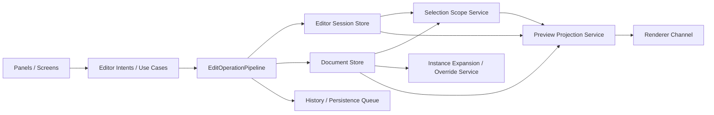

# WORKBENCH-V1 Architecture Draft

## Goal

`WORKBENCH-V1` is a reset project for rebuilding the editor with clear ownership boundaries.

The primary goal is not feature parity on day 1.
The primary goal is to rebuild the core editing loop with a cleaner model:

1. select
2. inspect
3. edit
4. preview
5. save

The broader V1 product loop starts before selection when Codex Desktop authors source from a user request:

```text
user request -> Codex-authored TSX -> editable tree -> layers/preview/inspector -> edit operation -> tree/code sync -> renderer -> visual verification
```

Workbench must treat Codex-authored TSX as a real source input boundary. Once imported or parsed, the result must become selectable, inspectable, editable, and verifiable through the same V1 editing contracts as any other source-backed page or component.

This draft is intentionally biased toward fewer concepts, stricter boundaries, and lower coupling.

## Why Rebuild

The earlier codebase had several areas where UI, state, projection, and persistence are tightly coupled:

- `InspectorPanel` owns too much write-routing logic
- `PreviewPanel` owns too much runtime/controller logic
- nested instance editing depends on panel-local branching
- `breadcrumb` is carrying multiple meanings at once
- expanded subtree behavior and persisted instance state are not cleanly separated
- debug logging is mixed directly into feature code

V1 should make these responsibilities explicit instead of letting them emerge implicitly in panels.

## Core Principles

### 1. Panels are thin

Panels should render UI and dispatch intents.
They should not decide persistence paths, scope ownership, or renderer payload shape.

Feature caches are not persistence shortcuts.
If a feature cache is used, it must be derived-only and either discarded after canonical edits or scoped to an explicit owner/source/revision fingerprint.

### 2. One editing intent, one write path

Every edit must flow through a single use-case layer:

- edit node prop
- edit instance prop
- edit node style
- edit instance override style
- change selection scope
- save entity

The panel should not know where the data is stored.

Editing means the full authoring lifecycle, not only a visible field write.
Create, patch, delete, copy, paste, cut, duplicate, move, reorder, import, re-import, undo, redo, navigation flush, and save flush should all use the same edit operation contract.

### 3. Persist compressed state, derive expanded state

Instance nodes should persist only their stable state:

- origin
- prop values
- variant selection
- instance-local overrides

Expanded subtree should be derived for preview/interaction, never treated as a second persistence model.

### 4. Scope is a first-class model

Selection, drill-in, nested instance ownership, and preview focus should all use one shared scope model.

Do not let `breadcrumb` remain a raw array with implicit meanings.

### 5. Renderer projection is separate from editor state

Editor state is not renderer payload.
A projector layer should convert editor state into renderer-ready payloads.

### 6. Debugging is opt-in

Debug output must go through one debug utility with categories and flags.
No direct `console.log` in product flow except controlled error paths.

### 7. Codex-authored source is an input boundary

Codex Desktop may create or modify TSX pages and components before the user touches them in Workbench.
Architecture should treat that source as an authoring input, not as opaque generated output.

That means:

- source parsing must produce explicit diagnostics when generated TSX cannot be projected
- editable tree projection must preserve enough identity for layer selection, preview selection, and Inspector edits
- Inspector edits against Codex-authored source must use the same source-backed write path as other source edits
- panels must not assume every editable artifact was first created through Workbench UI controls
- no in-app AI prompt surface is required for this workflow

Agent context has a separate, bounded ownership rule. Repository and generated
project skills contain normative working instructions. Reviewed organizational
knowledge lives in the fixed public-safe context file
`docs/workbench-agent/WORKBENCH-ORGANIZATIONAL-CONTEXT.md` inside a project.
The authoring MCP may summarize only allowlisted sections when that file is
marked `Audience: public` and `Status: curated`. It must not crawl Git history,
session artifacts, raw conversations, personal memory, or files outside the
project to manufacture organizational context. Missing, non-public, oversized,
or out-of-root context remains explicitly unavailable or excluded.

### 8. The installed app exposes one local browser gateway

The local companion process is not the primary renderer.
Its browser entry point is a loopback gateway such as
`http://127.0.0.1:4318/`, not a hosted renderer URL carrying bridge
credentials.

The gateway:

- asks the user to approve each new browser session
- stores the approved session in an HTTP-only, same-site cookie
- proxies the current hosted renderer and hosted-core API through the local
  origin, with the packaged renderer as an offline fallback
- serves project preview/runtime modules from the active local project
- proxies scoped project file operations to the authenticated local bridge

The companion prefers a stable loopback gateway port so browser-local account
state survives companion restarts. If that port is already occupied, it may
fall back to an ephemeral port, but that fallback is exceptional and does not
provide the same origin-local session continuity.

Project-local components used together in the design canvas must be compiled
into one shared runtime bundle for the active tree. Bundling each component
entry independently duplicates package singletons such as React Context,
breaking compound-component behavior (for example `AvatarGroup` overlap,
portal ownership, or provider-driven styling) even when the CSS itself loaded.

The local bridge bearer token stays between the companion processes. It must
not appear in a browser history, address bar, or hosted access log.
Codex and other browser-capable agents can discover the loopback gateway port
and inspect the same complete browser UI after the user approves the session.
The companion opens the browser only once during its process lifetime; repeated
Dock/app-icon activation must not create additional browser windows or tabs.
If the user rejects a browser-session approval request, the companion clears
that one-open guard so the next Dock/app-icon activation can retry pairing.
Before opening approval or native folder-selection dialogs, the companion must
activate itself so those OS surfaces appear in front of the browser rather than
behind it.

## Proposed High-Level Architecture



## State Model

### Current Implementation Status

The stores described below are target architecture boundaries, not a claim that
the current app shell already owns them as connected runtime stores.

The current persisted workspace-session authority is
`WorkbenchSelectionState`, loaded and sanitized from `.workbench/selection.json`.
`ProjectWorkspace` coordinates selection updates and persistence. `DesignEditor`
still owns several transient editor concerns, including selection/runtime undo
ordering, while source and token history lanes persist through
`.workbench/history.json`.

Known top-level workspace-session fields are typed by
`WorkbenchWorkspaceSessionExtensions`. Unknown extension fields remain
forward-compatible and are preserved, while the session sanitizer removes
malformed values for known fields before the UI consumes them. The nested Token
Editor query, filter, and table-width session contract is typed and normalized at
the same load boundary; Token Editor still owns its transient state and emits
the persisted snapshot through `ProjectWorkspace`. Design target identity,
active/multi-selected layer state, collapsed layers, and preview drill path use
the same typed workspace-session contract without moving their ownership out of
the existing selection flow. Source/Layers section, source-group, and page-folder
collapse preferences are normalized as UI-only session state. Design Story
component identity and scalar Story args are also normalized at this boundary,
while CSF source metadata remains the component contract authority. Inspector
token-picker collection/group filters are normalized as UI-only preferences and
do not mutate token scopes or bindings. Persisted preview appearance, token-mode
selection, and iframe viewport dimensions are typed and sanitized as separate
session fields; this viewport snapshot does not redefine responsive authoring
or page-state branches. Effective system appearance and registry-valid mode
defaults remain renderer-time derivations.

The app shell must not instantiate parallel no-op document, editor-session, or
preview-session stores beside those live paths. Introduce a runtime provider
only when it is backed by the canonical project/session state, exposes real
mutation or subscription behavior, and has an active consumer. Migrate one
bounded state category at a time with selection/history compatibility tests.

`RendererPort` remains the intended renderer boundary. A preview projection
service should be introduced when it projects the real canonical state used by
the visible preview, not as a disconnected placeholder payload.

### Document Store

Persistent project data only:

- pages
- components
- tokens
- component definitions
- instance persisted state

Must not hold:

- transient preview-only dummy props
- hover state
- panel UI mode
- renderer channel cache

### Editor Session Store

Transient editing session state:

- active entity
- dirty state
- editing mode
- current selection scope id
- current draft/working tree
- undo/redo session state

### UI Store

Pure UI state:

- panel visibility
- viewport
- tabs/modes
- local popover/dialog state

### Preview Session Store

Preview-only transient inputs:

- expression dummy values
- play-mode runtime state snapshot
- renderer focus/debug toggles

This should not live in the document store.

## Source of Truth Rules

### Node Tree

The editable tree is the source of truth for structure.

`src/domain/document/editableTree.ts` owns the current typed editable tree scaffold. Design surfaces should derive layer selection and inspectable node identity from this tree instead of mapping component assets directly into layer rows.

`src/domain/document/editableTreeProjectSource.ts` adapts page/component registry entries into this tree when a registry entry exposes `extensions.editableTree`.
`src/domain/document/editableTreeSourceParser.ts` is the current Babel AST source-file parser used as a foundation bridge from `sourceFile` contents to `EditableDocumentTree`. If it cannot parse TSX, find a component function, or read a JSX return tree, it must return an explicit diagnostic and allow the UI to fall back to the preview scaffold. Unsupported JSX expressions may be represented as visible placeholders only when the diagnostic reports them.

The editable tree also carries source facts that are not themselves visual
nodes:

- `sourceAttributes` preserves attributes such as `className`, including
  Tailwind utility strings.
- `sourceProps` preserves simple prop values that can be shown or edited by the
  Inspector.
- `sourceRuntimeProps` preserves statically evaluated bound data the Inspector
  cannot edit (nested arrays and objects, `null`): the canvas forwards it to
  the runtime component read-only while the authored expression stays in
  `sourceJsxProps` for writeback. Where the React parser also keeps a flat
  array projection in `sourceProps` for array editing, the runtime value is
  the complete data and wins on the canvas.
- `sourceDataBindings` records data-like props connected to JSON imports or
  source expressions so the Binding tab can explain where rendered rows come
  from.
- `sourcePropArrayReferences` records local array/object props that are safe to
  expose as array-shaped editing data without replacing the original source
  structure.
- `sourceExpression` records JSX expressions such as `.map(...)`, call/member
  expressions, conditionals, and templates that cannot yet become direct design
  controls. Design Preview renders these as concise, selectable source
  boundaries (`Map · source`, `Condition · expression`) instead of raw dummy
  text. Selecting one reveals its canvas location and opens selection-specific
  Binding guidance before page-level design states; the exact expression stays
  read-only unless a safe data writer exists.

Page modules may declare `workbenchDesignStateGroups` beside their component to
describe literal `useState` preview controls. Each group owns a stable id, label,
description, visibility, and an ordered `states` list. A state entry may remain
a source-name string or use `{ name, label, description }` when designers need
clearer product language. This metadata only organizes Binding controls and
preview overrides; it does not create another state store or turn an override
into source writeback.

These fields are source metadata, not a second rendering model. Layers and
Inspector may use them to explain or edit source safely, but they must not
fabricate static children that the source does not own.

### Source Component Runtime

Source-backed components have two related but different responsibilities:

- They must render in the Design preview runtime.
- They must expose enough editable structure, props, and child slot metadata for
  Workbench to inspect and write source safely.

Do not collapse these into one assumption. A third-party dependency can be
valid React while still failing in the current preview runtime if the loader
cannot resolve its package format or React aliasing. When that happens:

- Keep rich runtime dependencies for components that truly need them, such as
  Three.js, canvas, maps, charts, and rich editors.
- Treat those components as runtime previews with explicit editable props rather
  than trying to project every internal DOM node.
- Put heavy runtime dependencies behind project-local component islands instead
  of embedding their JSX directly in editable page source. For example, a
  dashboard page should compose `<ChartAreaInteractive />` or
  `<TravelExpenseCharts />`, while the local component owns `recharts` imports,
  package-specific child structure, and measurement behavior.
- Do not broaden the Design canvas loader to execute arbitrary bare package
  imports from page-level editable nodes. That turns the editable tree renderer
  into a partial app runtime, increases idle-time performance risk, and can
  create duplicate dependency or React aliasing failures. Runtime islands are
  the safer boundary.
- For starter or bundled components whose purpose is to demonstrate Workbench
  editing, prefer Workbench-native source that the preview runtime can load
  reliably.
- If a shadcn/ui or Radix-style component is converted to native HTML/React for
  preview stability, preserve the public design contract: props, expected
  browser interaction states, tokens, story controls, source insertion, and
  child slot rules.
- Record changed behavior in the component authoring guide instead of leaving
  stale dependency or accessibility claims.

The preview renderer may show runtime output that is not fully source-editable.
That is acceptable when the component contract is explicit. It is not
acceptable for a starter component to render a failure card, inert controls, or
an editable tree that does not match the visible component.

Base UI and shadcn-style components are supported as Workbench-owned wrappers.
The wrapper is the editable contract. Workbench should preserve the behavior
primitive when it provides real accessibility, keyboard, focus, portal, or
compound-state behavior, while keeping the wrapper's props, children, stories,
registry metadata, and source insert defaults editable.

The Design preview's selection instrumentation is allowed to add metadata, but
it must not change a valid component's runtime child contract. Even
`display: contents` anchors can break React-level child parsing, compound-child
ownership, and direct-child CSS selectors such as `:first-child`,
`:last-child`, sibling selectors, and child combinators. When a standalone
browser/page preview is correct but the Design canvas breaks a wrapper-sensitive
component, treat it as a preview projection issue. Pass runtime selection props
directly to the affected root or sub-component, or render slot-marker children
through the runtime-owned children path before passing them to a parent that
parses child types.

The projection model is wrapperless selection metadata for source-backed runtime
components. The preview runtime renders the real component with source identity,
selection handlers, and owner attributes passed to the component root. It must
not insert an editor-only DOM anchor, including a `display: contents` anchor,
between authored runtime components. Components that drop the injected root
props violate the Workbench component contract and should remain honestly
non-hit-testable until their root-prop forwarding is fixed; the runtime must not
restore selection by changing their DOM ancestry. Select, Combobox, Menu,
Popover, Dialog, Sheet, Drawer, AppShell, SideNav, Grid, Stack, ButtonGroup,
Item/ItemSlot, AvatarGroup, and similar slot/compound families must not receive
DOM between the parent and children that the library parses. Every change to
this boundary must be proven in the Design canvas by selecting parent and child
layers and confirming registered Inspector props still appear.

The Design runtime keeps a component-owned `ref` isolated and projects source
identity through root props plus a neutral runtime marker class. A source
component that forwards `className` to its real DOM root therefore remains
measurable even when an underlying library filters unknown `data-*` props,
without an editor ref replacing the component's own lifecycle ref. A DOM-less
compound component must route root props to its primary visible interaction
target, such as a menu or popover trigger. Preview-root event delegation is the
selection and drag path for these instrumented targets. Editor-owned `onClick`,
pointer, keyboard, `role`, and `tabIndex` props must not be projected through a
project component API: libraries commonly reuse those names with callback
signatures or semantics that differ from native DOM events. Authored handlers
remain component props; only editor interaction instrumentation is isolated.
Accessible `aria-controls` trigger-to-surface relationships provide the visual
fallback when a DOM-less compound root marker is attached to a closed menu or
dialog with no box;
it is not permission to reintroduce a layout wrapper.
Hit ownership follows the rendered interaction contract, not component names:
an explicit controlled surface owns its trigger first, then the nearest visible
source marker owns the hit, and only then may an ancestor runtime owner provide
a fallback. Command/Ctrl-click resolves the nearest rendered source boundary
without promoting it to an ancestor; clicking a Stack or Section surface
therefore selects that container. Command/Ctrl+Shift normalizes the hit to the
shared sibling scope while adding to the selection.

Interactive controls use a press-to-drag threshold. Pointer down must preserve
the current selection and the component's click behavior. Only movement beyond
the shared drag threshold may capture the pointer, suppress the click, and
start source movement. This lets a selected menu, popover, or drawer trigger
remain both operable and draggable.

Overlay primitives require special care. Dropdown, select, dialog, drawer,
sheet, tooltip, and menu content must render into the preview/page portal root
when they are being inspected, not into a global document location that visually
covers or breaks the Workbench shell. A component that works in a standalone
browser but crashes or whites out the Workbench preview is still a component
integration bug.

### Project Runtime CSS, Tailwind, And Assets

Workbench can load ordinary project CSS independently of the component import
graph. For Tailwind projects, the project may declare
`extensions.tailwind` in `.workbench/workbench.config.json`:

```json
{
  "extensions": {
    "tailwind": {
      "enabled": true,
      "sourceCss": "src/index.css",
      "compiledCss": "src/workbench-tailwind.css",
      "tokenCss": "src/workbench-tokens.css"
    }
  }
}
```

`compiledCss` is the authoritative preview input when configured. The local dev
server watches Tailwind-relevant project files, including TSX/JSX sources, and
runs the Workbench Tailwind sync script to refresh compiled preview CSS.
`tokenCss` carries CSS variables such as shadcn theme variables. When a compiled
file is configured, the source CSS is not double-loaded into preview.

Tailwind and project CSS paths in Workbench config must be project-relative
paths such as `src/index.css` or `src/workbench-tailwind.css`. Runtime loaders
may rebase stale absolute paths when they contain a known project root segment
such as `src/`, but newly authored config, component metadata, story metadata,
and AI-generated project files must not persist machine-specific paths like
`/Users/...`, `C:\Users\...`, or Vite `@fs/...` URLs. Relative imports that
would climb above the project root are invalid instead of being silently mapped
to another project file.

Tailwind preview rendering uses one exclusive mode at a time:

- `compiled`: load the project's configured `compiledCss` and inject no
  Workbench-generated Tailwind utility or fallback CSS.
- `fallback`: only when Tailwind is enabled without a configured compiled CSS
  path, derive approximate utility rules from parsed source and rendered class
  names.
- `disabled`: inject neither compiled Tailwind CSS nor Workbench fallback CSS.

The fallback generator is not a second styling source and must never be mixed
with configured compiled CSS. A missing or stale configured compiled file is a
project/compiler diagnostic, not permission to silently fill perceived gaps
with synthetic rules. When source classes change, refresh the real compiled CSS
and atomically replace the previous compiled snapshot.

Preview CSS readiness has two independent axes:

- `fresh`: the synchronized output corresponds to the current set of
  Tailwind-relevant project inputs.
- `representative`: the output was derived from this project's source and can
  faithfully stand in for the project's Tailwind layer.

`renderFreshness.ready` is true only when both axes are true and synchronization
has no error. A non-Tailwind project is representative by definition because it
has no Tailwind layer to omit. A Workbench install-free CSS seed can be fresh as
a file while remaining non-representative; its snapshot marker and build receipt
must therefore keep `ready` false. Missing receipts, preserved stale output, and
failed builds also remain non-ready instead of being reported as a successful
zero-error render.

The local bridge exposes this contract through preview CSS status events, the
authenticated preview CSS status route, and authoring inspect/apply/verify
responses. Render-dependent audits must consume `renderFreshness.ready` and
return an unavailable or unverified result when it is false; they must not infer
readiness from the existence or modification time of the compiled file.

Tailwind source writeback must preserve that contract. Inspector utilities may
append, replace, or remove `className` tokens through source history, but they
must not silently convert class-backed layout or sizing into JSX inline
`style={{ width: ... }}` or `style={{ height: ... }}` declarations. Clearing an
existing inline declaration is allowed; creating new inline size declarations
on Tailwind class-backed nodes is not.

Tailwind utilities are a first-class page composition surface when they live in
source `className` on editable nodes. Absolute overlays, grid tracks, z-index,
object-fit, overflow, backdrop filters, aspect ratio, spacing, sizing, color,
state, and responsive utilities are valid. They should be attached to registered
components whenever component Inspector identity matters. Large page-local CSS
systems, custom `data-*` styling APIs, and raw wrapper trees are not a substitute
for a source-backed component plus Tailwind class contract.

This is the current architecture contract and supersedes any older
non-Tailwind-era assumption. Workbench may constrain how class tokens are
edited, synced, or previewed, but Tailwind itself is an intended source input.

Project assets are served from the project public asset space, including
`/assets/` and `/workbench-assets/`. The asset manager can install images,
videos, icon sets, and fonts into that space and register them in
`.workbench/assets.json`. Source components should reference those public paths
or asset registry values instead of embedding opaque generated data.

### Component Instance

A component instance persists only:

- `origin`
- `propValues`
- `variantSelection`
- instance-scoped style overrides
- instance-scoped slot/content overrides if supported

It does not persist a fully expanded cloned subtree as a second truth source.

### Expanded Tree

Expanded tree is derived from:

- source component definition
- instance persisted state
- variant selection
- override patches

Expanded tree is allowed in preview and hit-testing.
It should not become the save model.

### Selection Scope

The scope model should resolve:

- effective root
- owner instance chain
- selected node in visible scope
- save target for edits
- renderer focus path

Panels should consume this resolved model, not reconstruct it.

Design source target selection is part of this model.
Switching between a page and a component must update `WorkbenchSelectionState.activeTarget` and persist through `.workbench/selection.json`.
The Design Editor may render the target picker, but it must not keep the active page/component owner as panel-only state.
Preview-area target tabs are another view over the same selection target, not a separate active-target state. Their open/close list is workspace session UI state persisted in `WorkbenchSelectionState.extensions`, while the active page/component owner still comes from `WorkbenchSelectionState.activeTarget`. Persisting the tab strip must not make tabs part of the page/component registry.
Preview token mode choices follow the same boundary: they are persisted workspace session state, not renderer cache or Design Editor local memory.
Preview appearance follows the same workspace-session boundary, but it is not a
token collection mode. Token modes are per-collection design selections;
preview appearance is the rendering media state (`system`, `light`, or `dark`).
Explicit `light` or `dark` appearance may synchronize collections whose mode
id or name is exactly light/dark for user convenience, but it must not reinterpret
arbitrary theme modes such as `butter`, `matcha`, or `compact` as color-scheme
modes. `system` derives an effective light/dark rendering state from
`prefers-color-scheme` without mutating the user's saved token mode selection.
Preview roots, including source iframe, page preview, runtime story projection,
and picker previews, must receive consistent `data-wb-preview-appearance`,
`data-theme`, library media attributes such as `data-astryx-media`, and effective
`data-wb-token-modes` so token CSS selectors and runtime variables agree.
Selected design layer and panel/sidebar split dimensions follow the same boundary. They are persisted workspace session state, not hook-local defaults.

## Key Services

### `selection-scope.service.ts`

Input:

- parsed tree
- active entity
- visible components
- drill path / scope id
- selected node id

Output:

- effective root
- scope chain
- owner instance id
- selected node resolved in scope
- css key path for preview focus
- whether edit targets root or instance override

This service replaces panel-local breadcrumb interpretation.

### `instance-edit.service.ts`

Owns nested component edit routing.

Responsibilities:

- determine whether an edit targets component source or instance override
- apply instance prop edits
- apply instance style edits
- reject unsupported edit types with explicit reason
- return a patch result, not UI actions

### `edit-operation-pipeline.ts`

Owns lifecycle semantics for product mutation.

Responsibilities:

- capture the current draft before mutation
- resolve selection scope and save target
- normalize UI intent into a canonical edit operation
- validate target, owner, permissions, and compatible value type
- apply the domain operation to canonical state
- commit one history transaction with selection before/after
- queue persistence and save-flush work
- request projection regeneration by operation intent
- restore or repair selection after undo, redo, delete, paste, duplicate, import, or navigation

This pipeline is the V1 replacement for the earlier implementation's scattered history guards, page-navigation save guards, autosave backup paths, and panel-local save routing.
The detailed contract lives in `docs/WORKBENCH-V1-EDIT-OPERATIONS.md`.

Related adapters:

- `editFlushOperations.ts`
  Defines save flush and navigation flush as persistence boundary operations. These boundaries must not create undo stack pollution.
- `projectAssetHistory.ts`
  Maps page and component source files to page/component history owners so Inspector edits can later use file-scoped lanes instead of token-only history.
- `inspectorEditService.ts`
  Owns Inspector command validation and operation metadata for field-level edits. Inspector components collect values; this service decides field compatibility and mutation semantics.
- `editableTreeSourcePersistence.ts`
  Bridges source history lanes to application persistence adapters. It writes the source file first, marks the lane saved only after that write succeeds, then persists the history lane and `lastFlush` metadata.
- `editableTreeSourceInspector.ts`
  Orchestrates source-backed Inspector token binding edits. It commits source writeback into the source history lane, appends timeline metadata, and then calls the persistence boundary. Inspector UI should call this orchestration layer instead of ordering writeback, file save, and history save itself.

### `instance-expand.service.ts`

Pure derivation layer:

- expand instance from compressed persisted state
- apply variant selection
- apply prop overlays
- apply instance override patches

This service must be deterministic and side-effect free.

### `preview-projection.service.ts`

Preview UI must render the current editable result as a visual canvas, not a tree expansion view.
Layers and Inspector may expose structure and metadata; Preview should stay focused on what the user is visually editing and selecting.

Builds renderer payload from:

- working tree
- visible component registry
- token output
- preview session state
- active scope

Responsibilities:

- build inline CSS maps
- build instance override CSS maps
- project binding payloads
- project preview props
- project drill focus chain

### `preview-layer.service.ts`

Owns the layer list shown beside preview.

Responsibilities:

- derive visible/editable layers from the current preview tree or typed preview scaffold
- keep component library variants out of the layer tree
- expose layer kind, nesting depth, inspectability, and backing source identity
- preserve collection-scoped token binding references for Inspector and preview resolution
- provide stable layer ids for selection and Inspector routing
- consume `EditableTreeNode` as input. Asset/component metadata may be attached as node source data, but it must not be the layer source itself.

Layer derivation and preview hit-testing must stay aligned. A page preview that
renders visually while the layer tree cannot select the registered component, or
the Inspector shows only generic DOM fields for a registered component instance,
is a failed projection. Browser/page preview metrics alone are not sufficient
evidence for source-backed editability.

### `editable-tree-source-parser.ts`

AST-backed foundation bridge before full TSX round-trip writeback is connected.

Responsibilities:

- parse a source file with Babel `typescript` + `jsx`
- load Babel parsing only at the source-read boundary, not as always-on editor UI state
- find the primary exported component function or referenced default-export component
- read returned JSX into a conservative `EditableDocumentTree`
- identify frame, component-instance, and text nodes for layer/Inspector foundation testing
- attach source file and source location metadata to editable nodes
- preserve source attributes, simple props, JSX-prop component names, and value
  metadata so Inspector can show the real source contract
- detect data imports and data-like props for Binding tab explanations
- detect local array/object prop references that can be edited as source arrays
- classify unsupported JSX expressions, including `.map(...)`, call, member,
  conditional, logical, template, object, and array expressions
- read token binding attributes as `{ collectionId, tokenId }` when the source includes collection attributes, while preserving bare token ids only as legacy compatibility metadata
- fail explicitly with a diagnostic instead of fabricating a silent tree
- report unsupported JSX expressions as placeholders, not as silent drops
- stay replaceable by the later AST codegen/writeback boundary

### `editable-tree-source-writeback.ts`

AST-backed writeback boundary for source-backed Inspector edits.

Responsibilities:

- accept an `EditableTreeNode` with `sourceFile` and `sourceLocation`
- re-parse the source file before writing so stale or fabricated ranges do not mutate the wrong JSX element
- match the concrete JSX element by source range
- update or insert token binding attributes for supported Inspector fields, including both the token id attribute and its collection identity attribute
- update supported source attributes and component props without losing
  expression metadata that is outside the edit
- update local referenced arrays only when the attribute still resolves to an
  editable local array expression
- return changed/no-op/failure explicitly
- emit an edit operation descriptor with affected source file, projection invalidation, cleanup notes, and derived-cache discard policy
- avoid direct file writes inside the domain helper; UI/application services decide when to persist returned contents

### `editable-tree-source-inspector.ts`

Source-backed Inspector orchestration boundary.

Responsibilities:

- accept a selected editable node, token field, collection-scoped token reference, page/component subject, source history lane, and persistence adapters
- run source writeback through `commitSourceTokenBindingSessionEdit`
- append history timeline metadata for successful source transactions
- persist through `editableTreeSourcePersistence.ts`
- report no-op edits without writing files
- return diagnostics and keep dirty source history when persistence fails
- coordinate source-backed component prop and referenced-array prop edits through
  the same source history lane rather than panel-local file writes

### `editable-tree-source-session.ts`

Source file edit-session boundary for page/component source history.

Responsibilities:

- resolve a `sourceFile` back to a page/component subject
- commit source writeback results into the page/component history lane
- preserve undo/redo over source contents, not over a UI-only preview state
- create source save-flush metadata without polluting the undo stack
- expose saved contents to the application persistence boundary
- separate save planning from saved-state marking so failed file writes cannot clear dirty state
- keep file writes outside the domain helper

### `editable-tree-source-persistence.ts`

Application-boundary orchestration for source-backed history lanes.

Responsibilities:

- accept injected persistence adapters instead of importing filesystem helpers into the domain boundary
- create a source save plan from the current history lane
- write dirty source contents before marking the lane saved
- leave the source lane dirty and return a diagnostic when source file writing fails
- persist the page/component source history lane with `lastFlush` metadata after successful source persistence
- avoid rewriting source files when the lane is already saved while still allowing history metadata persistence

### `entity-save.service.ts`

Owns save semantics:

- flush working draft
- serialize code and css blocks
- write to document store
- clear preview-only stale state when required

`page-navigation` should call this service, not hand-roll save guards.

### `debug.ts`

Single debug entry point:

- category-based logs
- environment/flag gated
- no-op in normal usage

Example categories:

- `preview`
- `scope`
- `instance`
- `save`
- `renderer`

## Proposed Folder Structure

```text
WORKBENCH-V1/
  docs/
    architecture/
      editor-model.md
      selection-scope.md
      instance-editing.md
      preview-projection.md
  src/
    app/
      App.tsx
      routes/
      providers/
    domain/
      document/
        model/
        stores/
        services/
      editor/
        model/
        stores/
        services/
      selection/
        model/
        services/
      preview/
        model/
        stores/
        services/
      renderer/
        services/
      tokens/
        model/
        stores/
        services/
    features/
      canvas/
        components/
        hooks/
      inspector/
        components/
        hooks/
      layers/
        components/
      code-editor/
        components/
    shared/
      lib/
      utils/
      types/
      debug/
    renderer/
      src/
  tests/
```

## Boundary Rules

### `features/*`

UI composition only.
May use stores/hooks/services, but should not contain persistence logic.

### `domain/*/stores`

State only.
Avoid codegen, payload assembly, DOM queries, and panel branching.

### `domain/*/services`

Pure logic or clearly scoped orchestration.
Prefer explicit inputs and outputs.

### `renderer/services`

Renderer payload assembly and transport only.
No editor interaction rules here.

### `shared/debug`

Only place where debug logging is allowed.

## Initial V1 Milestone

The first build should be intentionally small.

### Milestone 1: Core Editing Loop

Ship only:

- page open
- canvas render
- select node
- drill into scope
- inspect simple props
- edit inline styles
- save current entity

Do not include yet:

- AI generation
- bindings editor
- complex token workflows
- extract-to-component
- advanced slot management
- variant snapshot tooling

### Milestone 2: Component Instances

Add:

- component insertion
- compressed instance persistence
- derived expansion in preview
- instance prop editing
- instance-local style override routing

### Milestone 3: Variants

Add:

- variant definition model
- resolved variant selection
- preview projection for variant conditions
- instance variant editing

### Milestone 4: Advanced Systems

Add selectively:

- bindings
- prop forwarding
- tokens
- AI
- import/export migration helpers

## Recommended First Build Order

1. bootstrap app shell and stores
2. define document/entity model
3. implement editor session model
4. implement selection scope service
5. implement preview projection service
6. build thin `PreviewPanel`
7. build thin `InspectorPanel`
8. add save/load flow
9. add component instance compressed model
10. add derived instance expansion

## What We Should Reuse From The Earlier Implementation

Reuse selectively:

- type ideas and naming where still sound
- TSX parse/codegen knowledge
- token resolution ideas
- useful tests as reference

Do not copy blindly:

- panel-local routing logic
- debug prints
- temporary compatibility layers
- race-condition guard globals unless re-justified
- expanded persistence assumptions

## Migration Strategy

V1 should start as a clean workspace.
The earlier implementation stays as historical context only.

Recommended migration rule:

- copy code only after the target boundary exists in V1
- port behavior with tests
- never port a large panel whole

## Immediate Next Step

Before creating `WORKBENCH-V1`, define three concrete specs:

1. editor session model
2. selection scope model
3. component instance persistence model

Once those are written, project scaffolding can start with much lower risk.
